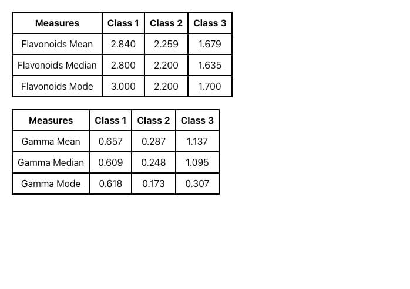

# Getting Started with Create React App

This project was bootstrapped with [Create React App](https://github.com/facebook/create-react-app).


# Mini Wine Data app



Basic analysis of Wine Data

## Getting Started

To get started with this project, follow these steps:

### Clone the Repository

```bash
git clone [https://github.com/your-username/your-repository.git](https://github.com/nishukum1211/Analytics-assignment.git)
yarn install
yarn start
